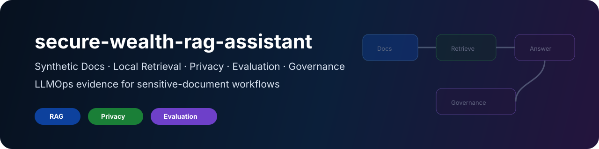
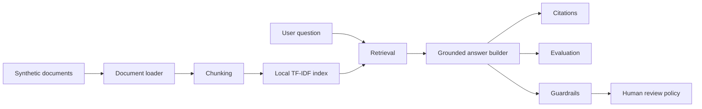

# secure-wealth-rag-assistant

<div align="center">



<br/>

**Secure RAG / LLMOps portfolio project for sensitive-document workflows using synthetic documents only**

RAG | Local Retrieval | Evaluation | Privacy Controls | Prompt-Injection Tests | Human Review | AI Governance


[](https://github.com/KinSushi/secure-wealth-rag-assistant/actions)


</div>

---

## Executive summary

`secure-wealth-rag-assistant` is a public LLMOps / RAG portfolio project demonstrating safe document ingestion, local retrieval, citation-grounded answering, privacy controls, prompt-injection testing and human-review governance using synthetic documents only.

```text
synthetic docs -> chunking -> local index -> retrieval -> grounded answer -> evaluation -> privacy / injection tests -> governance docs
```

The project is designed for regulated and data-intensive environments: private banking, insurance, health data, pharma/medtech, consulting, research and big-tech AI/data platforms.

No real client, banking, insurance, health, employer or private documents belong here.

---

## What an evaluation run produces (synthetic documents)

The assistant answers questions over **synthetic** wealth documents and is measured, not assumed, for quality and safety:

| Dimension | Output |
|---|---|
| Retrieval quality | top-k relevance and grounding checks in `reports/` |
| Answer evaluation | reference-based scoring on a synthetic Q/A set |
| Privacy controls | PII handling and redaction checks |
| Prompt-injection tests | adversarial prompts the assistant must refuse |
| Validation | `pytest` + `ruff` results in `docs/` |

Reproduce locally with the Quickstart commands. All documents are **synthetic**; no real client, banking or personal data is used.

---

## Target roles

| Role family | Why this project helps |
|---|---|
| AI Engineer | retrieval, grounded outputs and evaluation |
| LLMOps Engineer | prompt-injection tests, privacy controls and governance docs |
| AI Platform Engineer | safe workflow design and public technical evidence |
| Risk / Compliance Analytics | sensitive-document workflow boundaries and human review |
| Big-tech AI/data systems | testable retrieval, no external dependency, reproducible evaluation |

---

## Architecture



---

## Quickstart

```bash
make install
make test
make lint
make demo
```

Run CLI demo:

```bash
python -m secure_rag.app "What is the synthetic client's risk profile?"
```

Run evaluation:

```bash
make evaluate
```

---

## Public-safety rules

- synthetic documents only;
- no real client profiles;
- no real bank, insurance or health documents;
- no private PDFs, contracts or identity documents;
- no financial, medical, legal or insurance advice;
- no production decisioning claims;
- no employer-specific application content;
- no secrets or API keys.

---

## Non-goals

This project is not a production RAG platform, not a financial adviser, not a medical adviser, not a legal adviser, and not an application dossier.

---

## Portfolio layer

This repository is part of the KinSushi public technical portfolio.

| Layer | Evidence |
|---|---|
| LLMOps / RAG | synthetic documents, retrieval evaluation, prompt-injection tests, privacy controls |

Detailed cross-repository context: [docs/PORTFOLIO_LAYER.md](docs/PORTFOLIO_LAYER.md)

---

## Validation

Local and CI validation instructions are documented in [docs/VALIDATION.md](docs/VALIDATION.md).

---

## Screenshots and validation output

Screenshots generated from repository validation output are documented in [docs/screenshots.md](docs/screenshots.md).
# secure-wealth-rag-assistant

<div align="center">


<br/>

**Secure RAG / LLMOps portfolio project for sensitive-document workflows using synthetic documents only**

RAG | Local Retrieval | Evaluation | Privacy Controls | Prompt-Injection Tests | Human Review | AI Governance


[](https://github.com/KinSushi/secure-wealth-rag-assistant/actions)


</div>

---

## Executive summary

`secure-wealth-rag-assistant` is a public LLMOps / RAG portfolio project demonstrating safe document ingestion, local retrieval, citation-grounded answering, privacy controls, prompt-injection testing and human-review governance using synthetic documents only.

```text
synthetic docs -> chunking -> local index -> retrieval -> grounded answer -> evaluation -> privacy / injection tests -> governance docs
```

The project is designed for regulated and data-intensive environments: private banking, insurance, health data, pharma/medtech, consulting, research and big-tech AI/data platforms.

No real client, banking, insurance, health, employer or private documents belong here.

---

## What an evaluation run produces (synthetic documents)

The assistant answers questions over **synthetic** wealth documents and is measured, not assumed, for quality and safety:

| Dimension | Output |
|---|---|
| Retrieval quality | top-k relevance and grounding checks in `reports/` |
| Answer evaluation | reference-based scoring on a synthetic Q/A set |
| Privacy controls | PII handling and redaction checks |
| Prompt-injection tests | adversarial prompts the assistant must refuse |
| Validation | `pytest` + `ruff` results in `docs/` |

Reproduce locally with the Quickstart commands. All documents are **synthetic**; no real client, banking or personal data is used.

---

## Target roles

| Role family | Why this project helps |
|---|---|
| AI Engineer | retrieval, grounded outputs and evaluation |
| LLMOps Engineer | prompt-injection tests, privacy controls and governance docs |
| AI Platform Engineer | safe workflow design and public technical evidence |
| Risk / Compliance Analytics | sensitive-document workflow boundaries and human review |
| Big-tech AI/data systems | testable retrieval, no external dependency, reproducible evaluation |

---

## Architecture


---

## Quickstart

```bash
make install
make test
make lint
make demo
```

Run CLI demo:

```bash
python -m secure_rag.app "What is the synthetic client's risk profile?"
```

Run evaluation:

```bash
make evaluate
```

---

## Public-safety rules

- synthetic documents only;
- no real client profiles;
- no real bank, insurance or health documents;
- no private PDFs, contracts or identity documents;
- no financial, medical, legal or insurance advice;
- no production decisioning claims;
- no employer-specific application content;
- no secrets or API keys.

---

## Non-goals

This project is not a production RAG platform, not a financial adviser, not a medical adviser, not a legal adviser, and not an application dossier.

---

## Portfolio layer

This repository is part of the KinSushi public technical portfolio.

| Layer | Evidence |
|---|---|
| LLMOps / RAG | synthetic documents, retrieval evaluation, prompt-injection tests, privacy controls |

Detailed cross-repository context: [docs/PORTFOLIO_LAYER.md](docs/PORTFOLIO_LAYER.md)

---

## Validation

Local and CI validation instructions are documented in [docs/VALIDATION.md](docs/VALIDATION.md).

---

## Screenshots and validation output

Screenshots generated from repository validation output are documented in [docs/screenshots.md](docs/screenshots.md).
